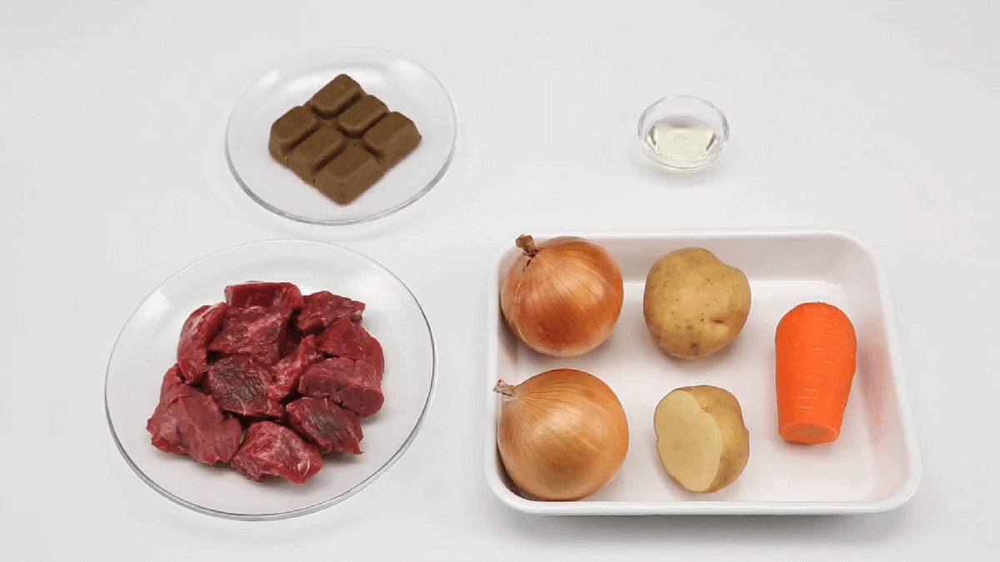
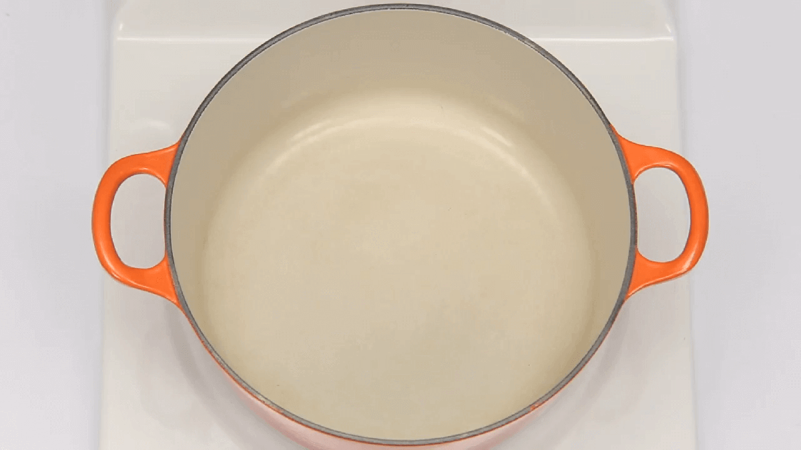

# おいしいカレーの作り方
### 材料(6皿分)

- バーモントカレー＜甘口＞…1/2箱（115g）
- 牛肉（角切り）…250g
- 玉ねぎ（中）…2個（400g）
- じゃがいも（中）…1・1/2個（230g）
- にんじん（中）…1/2本（100g）
- サラダ油…大さじ1
- 水…850ml

## 作り方

##### 具材を切る
1. 玉ねぎは縦半分に切り、平らな面を下にして芯などを取り除き、放射線状のくし切りにします。
2. じゃがいもは縦半分に切り、さらに半分に切ったものを2等分にします。1個を6～8等分に切り分けるのが目安です。

##### POINT

- じゃがいもは変色しやすいので、炒めるまで時間がかかる場合は水にさらしておきます。
- じゃがいもは、男爵を使うとほくほくした食感で煮崩れしやすく、メイクイーンを使うと煮崩れしにくいのが特徴です。じゃがいもが煮崩れすると、カレーのとろみが増します。お好みでお使いください。

3. にんじんは縦半分に切り、平らな面を下にして3cmくらいの大きさの乱切りにします。

##### 具材を炒める

4. 厚手の鍋にサラダ油を熱し、牛肉、玉ねぎ、じゃがいも、にんじんを入れ、肉に焼き目がつき、玉ねぎがしんなりするまで炒めます。

##### POINT

カレーのように長時間煮込む料理には、厚手の鍋が向いています。厚手の鍋は熱の伝わり方が間接的で平均しており保温性もよいので、途中で材料を加えても温度変化がゆるやかになります。

##### 煮る

5. 水を加え、沸騰したらあくを取ります。

##### POINT

あく取りは網じゃくしのようなものを使い、うまみの油や水分を取りすぎないよう注意します。

6. 具材が柔らかくなるまで弱火～中火で約15分煮込みます。

##### POINT
にんじんに竹串がすっと通るくらいが目安です。

##### ルウを入れて煮込む

7. いったん火を止め、沸騰がおさまってからルウを割り入れてよく溶かします。

##### POINT

ルウは煮立った中に入れると、溶けにくくなります。火を止めるのは、温度を低くしルウを溶けやすくするためです。

8. 再び弱火で時々かき混ぜながら、とろみがつくまで約10分煮込んででき上がりです。

##### POINT
- 調理後にはちみつを加えるととろみが弱くなる場合があります。はちみつを入れる場合はあく取りをした後に入れ、具材と一緒に弱火～中火で20分以上煮込んでください。

- 味見で口をつけたスプーンやお玉を鍋に戻すと、とろみがなくなる場合があります。小皿に移してから味見をしましょう。

- 少ない量で調理する場合は小さめの鍋を使い、焦げないよう注意してください。
