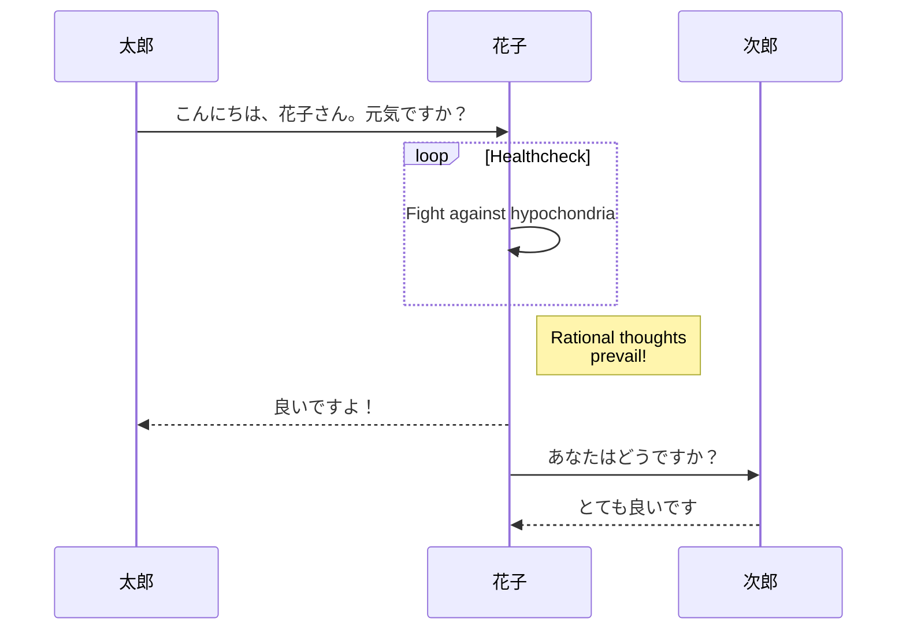
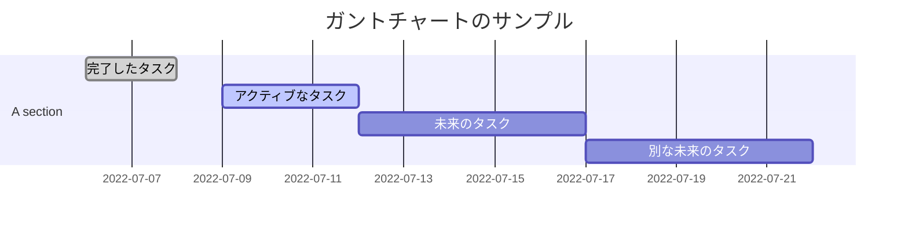
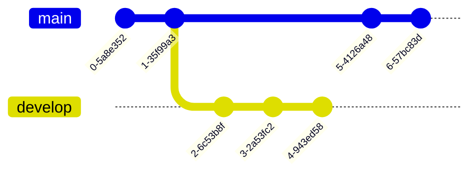
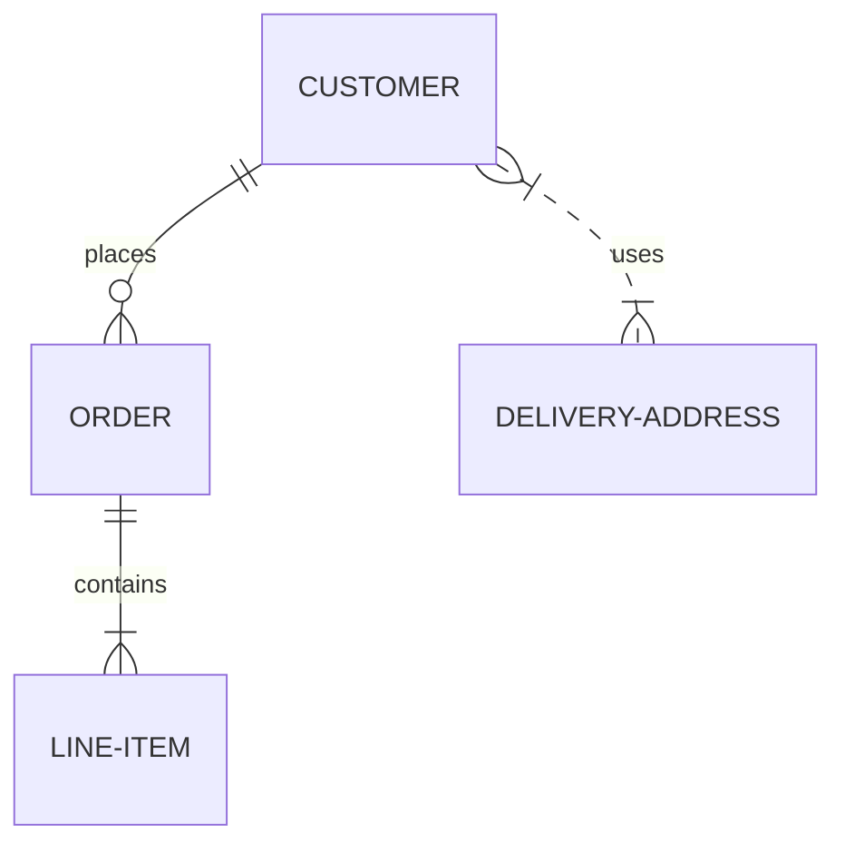

# Mermaidで記述できるダイアグラムの記述例とコード    
### 基本形
NotePMでMermaid記法を使う際には、コードブロックにて mermaid を指定してください。具体的には次のようになります。

``<!---->`mermaid
// この中にMermaid記法

`<!---->``

### フローチャート
フローチャートは```-->```で要素同士を結んでいくだけでです。


```
graph TD;
    A-->B;
    A-->C;
    B-->D;
    C-->D;
```


この内容は次のようなチャートになります。


### シーケンス図
状態遷移を表現するのに使われるシーケンス図は次のようになります。```-->>```や```->>```で記述するのが特徴です。
```
sequenceDiagram
    participant 太郎
    participant 花子
    太郎->>花子: こんにちは、花子さん。元気ですか？
    loop Healthcheck
        花子->>花子: Fight against hypochondria
    end
    Note right of 花子: Rational thoughts <br/>prevail!
    花子-->>太郎: 良いですよ！
    花子->>次郎: あなたはどうですか？
    次郎-->>花子: とても良いです
```


上の内容は次のようなシーケンス図として表示されます。

### ガントチャート
プロジェクトの進捗管理に使われるガントチャートです。
```
gantt
dateFormat  YYYY-MM-DD
title ガントチャートのサンプル
excludes weekdays 2014-01-10

section A section
完了したタスク            :done,    des1, 2022-07-06,2022-07-08
アクティブなタスク        :active,  des2, 2022-07-09, 3d
未来のタスク              :         des3, after des2, 5d
別な未来のタスク          :         des4, after des3, 5d
```
上の図は以下のように表示されます。


### クラス図
PlantUMLでも使われるクラス図です。関係性を示す矢印記号が多数あります。
```
Class diagram
classDiagram
Class01 <|-- AveryLongClass : Cool
Class03 *-- Class04
Class05 o-- Class06
Class07 .. Class08
Class09 --> C2 : Where am i?
Class09 --* C3
Class09 --|> Class07
Class07 : equals()
Class07 : Object[] elementData
Class01 : size()
Class01 : int chimp
Class01 : int gorilla
Class08 <--> C2: Cool label
```

```mermaid
Class diagram
classDiagram
Class01 <|-- AveryLongClass : Cool
Class03 *-- Class04
Class05 o-- Class06
Class07 .. Class08
Class09 --> C2 : Where am i?
Class09 --* C3
Class09 --|> Class07
Class07 : equals()
Class07 : Object[] elementData
Class01 : size()
Class01 : int chimp
Class01 : int gorilla
Class08 <--> C2: Cool label
```

### Gitグラフ
GitHubなどで見られるGitツリーです。利用用途は限られそうですが、ピンポイントで使える場面がありそうです。
```
    gitGraph
       commit
       commit
       branch develop
       commit
       commit
       commit
       checkout main
       commit
       commit
```


### ER図
データベースのスキーマを表現したりするのに使われるER図です。システム開発で便利でしょう。
```
erDiagram
    CUSTOMER ||--o{ ORDER : places
    ORDER ||--|{ LINE-ITEM : contains
    CUSTOMER }|..|{ DELIVERY-ADDRESS : uses
```

