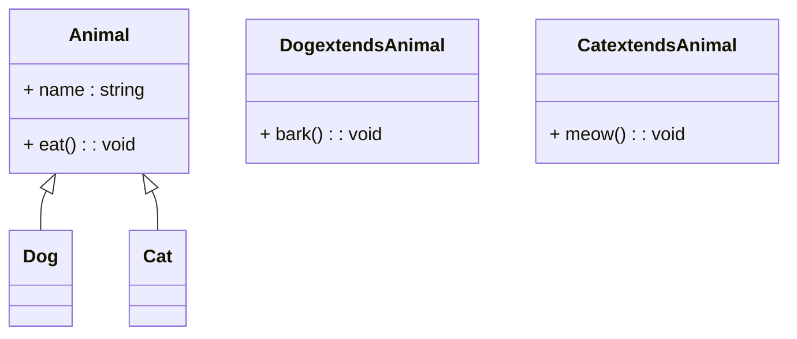

# mermaidで記述できるダイアグラムのチュートリアル

### 3. クラス図 (Class Diagram)
```
classDiagram
    class Animal {
        + name : string
        + eat() : void
    }
    
    class Dog extends Animal {
        + bark() : void
    }
    
    class Cat extends Animal {
        + meow() : void
    }
    
    Animal <|-- Dog
    Animal <|-- Cat
```
